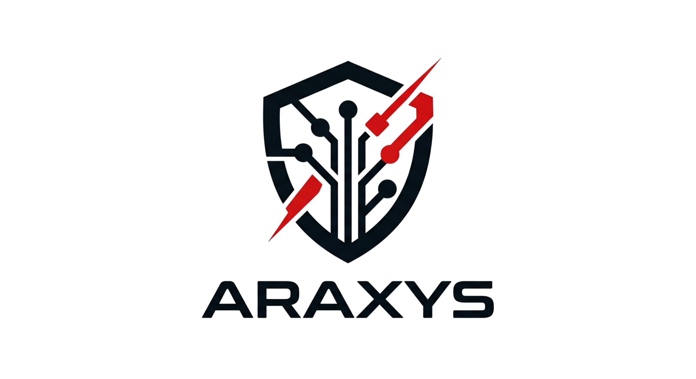

<div align="center">
  
  <h1>Araxys Documentation</h1>
  <p>Official performance-optimized documentation for the Araxys security library.</p>

  [](https://astro.build)
  [](https://tailwindcss.com)
  [](https://vercel.com)
  [](https://pnpm.io)
</div>

---

## 🛡️ About Araxys Web
This repository contains the source code for the **Araxys** documentation site. Built with speed, security, and aesthetics in mind, following the design principles of the Araxys security library.

## ✨ Features
- 🚀 **Astro 6 + Tailwind CSS v4**: Cutting-edge tech stack for maximum performance.
- 🔍 **Pagefind Search**: Lightning-fast, static search indexing for offline-capable documentation.
- 🎨 **Material Design**: Sleek dark-mode interface with Material Symbols integration.
- 📱 **Fully Responsive**: Optimized for all devices, from mobile to ultra-wide displays.
- ⚡ **Vercel Native**: Ready for instant edge deployment with Vercel Web Analytics.

## 🛠️ Local Development

Araxys Web uses **pnpm** as its primary package manager.

### Prerequisites
- **Node.js**: v22.12.0 or higher (Required for Astro v6)
- **pnpm**: Latest version

### Setup
```bash
# Install dependencies
pnpm install

# Start development server
pnpm dev
```

### Build & Index
The search engine requires an indexing step after the build:
```bash
# Build the site and run Pagefind indexing
pnpm build
```

## 📄 License
This project is licensed under the MIT License - see the [LICENSE](./LICENSE) file for details.

## 👤 Author
Built with 🛡️ by **Samuel Esteban Urrego Valencia**
- [GitHub](https://github.com/Samuel-Urrego)
- [LinkedIn](https://linkedin.com/in/samuelurrego)
