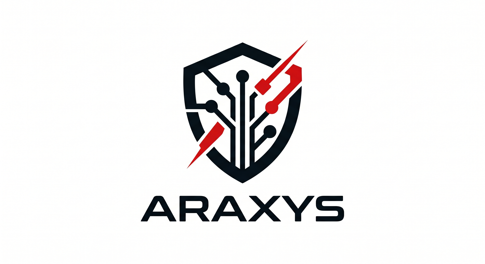

<div align="center">
  
  <h1>Araxys Documentation — v0.14.0</h1>
  <p>Official documentation for the Araxys security library — AWS WAF Bridge, Threat Intelligence, GraphQL Security, Headers Audit, Secrets Rotation.</p>

  [](https://astro.build)
  [](https://tailwindcss.com)
  [](https://vercel.com)
  [](https://pnpm.io)
  [](https://pagefind.app)
</div>

---

## 🛡️ About Araxys Web

Documentation site for the **Araxys** security library (v0.14.0). Covers 22+ security modules including the latest: AWS WAF Bridge, Threat Intelligence Feeds, GraphQL Security, Security Headers Audit, and Dynamic Secrets Rotation. Built with speed, security, and aesthetics in mind.

## ✨ Features

- 🚀 **Astro 6 + Tailwind CSS v4**: Cutting-edge tech stack for maximum performance.
- 🔍 **Pagefind Search**: Lightning-fast, static search indexing for offline-capable documentation.
- 🎨 **Dark-first Design**: Sleek dark-mode interface with Material Symbols and the Geist typeface.
- 📱 **Fully Responsive**: WCAG-compliant touch targets (44px), adaptive tables, and mobile-first layout.
- ⚡ **Vercel Native**: Ready for instant edge deployment with Vercel Web Analytics.

## 🛠️ Local Development

Araxys Web uses **pnpm** as its primary package manager.

### Prerequisites

- **Node.js**: v22.12.0 or higher (Required for Astro v6)
- **pnpm**: Latest version

### Setup

```bash
# Install dependencies
pnpm install

# Start development server
pnpm dev
```

### Build & Index

The search engine requires an indexing step after the build:

```bash
# Build the site and run Pagefind indexing
pnpm build
```

## 🔖 Version History

| Tag | Modules |
|-----|---------|
| `v0.14.0` | AWS WAF Bridge, Threat Intelligence, GraphQL Security, Headers Audit, Secrets Rotation |
| `v0.13.0` | XXE Protection, OIDC Discovery |
| `v0.12.0` | Malware Scanning |
| `v0.11.0` | Prompt Injection Detection |
| `v0.10.0` | WebAuthn / Passkeys, Redis Sentinel & Cluster, Webhook DLQ |

## 📄 License

This project is licensed under the MIT License — see the [LICENSE](./LICENSE) file for details.

## 👤 Author

Built with 🛡️ by **Samuel Esteban Urrego Valencia**
- [GitHub](https://github.com/Samuel-Urrego)
- [LinkedIn](https://linkedin.com/in/samuelurrego)
